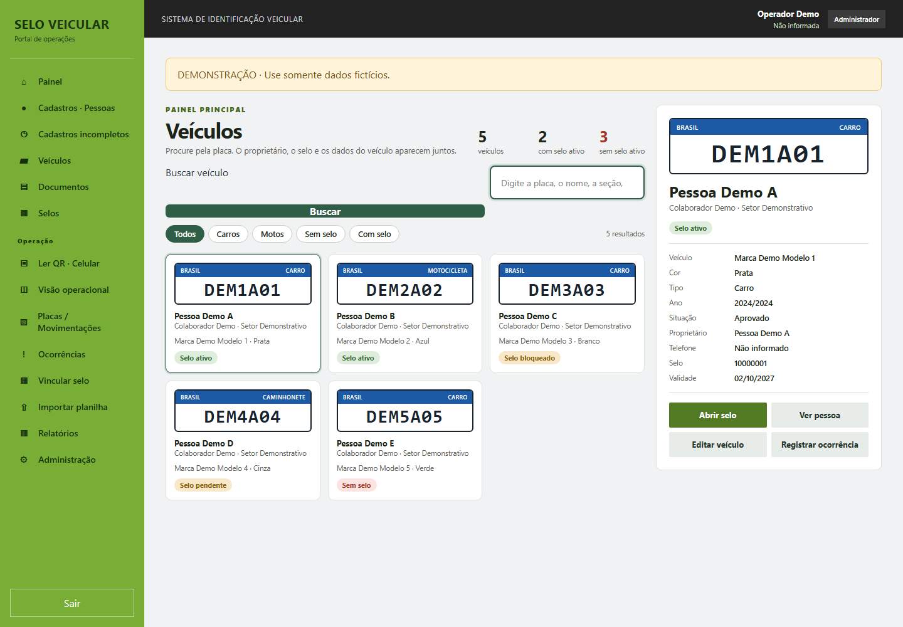
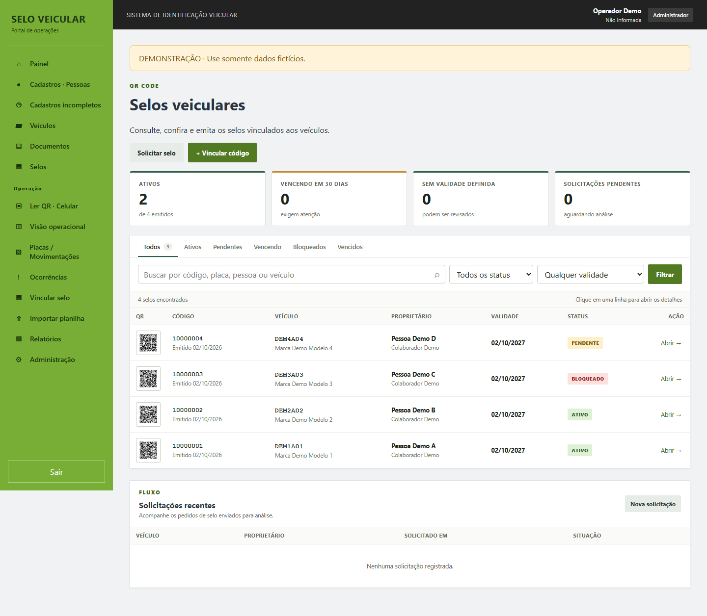
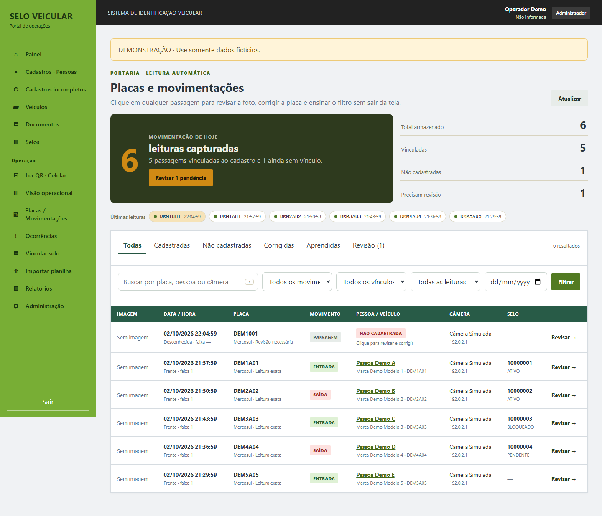
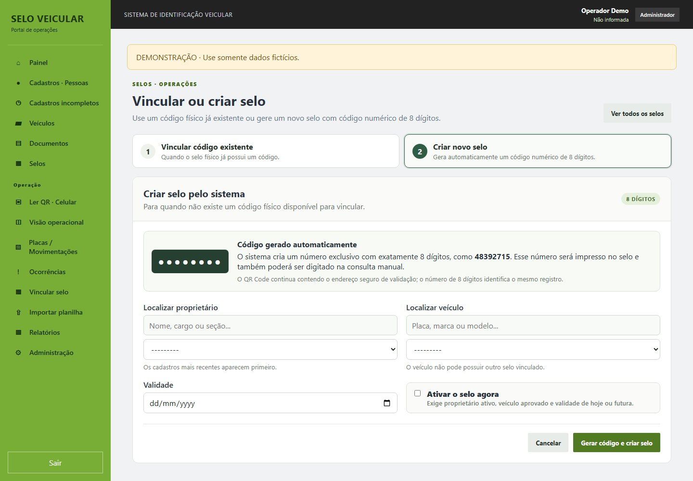

# Sistema de Selos Veiculares — Demo

Aplicação web para gestão de pessoas, veículos e selos de identificação com QR Code, consulta operacional, ocorrências e movimentações de placas. Esta edição pública reúne a base Linux e as atualizações até v11 em um único projeto Django, com identidade genérica e exemplos sintéticos.



## Visão geral

O sistema conecta cadastro → veículo → selo → consulta por QR ou código → ocorrência e histórico de movimentações. Pessoas cadastradas são registros operacionais separados das contas de acesso. Administradores e patrulhantes utilizam o portal autenticado; a administração de contas e permissões exige perfil administrativo.

É uma demonstração local de portfólio. Não contém banco de produção, credenciais, anexos pessoais ou configuração de rede institucional. Os exemplos são identificados como “Pessoa Demo”, “Organização Demo” e “Câmera Simulada”. Placas e números de documentos dos testes são inventados e não devem ser utilizados fora da demonstração.

## Funcionalidades

- Cadastro, pesquisa, conferência e histórico de alterações de pessoas.
- Cadastro de carros, motos e outros veículos; seleção de proprietário com busca e registros recentes.
- Importação CSV/TSV/XLSX com prévia, validação e confirmação; exportação de pendências.
- Vinculação de selo existente ou criação de código exclusivo de oito dígitos.
- Selo PDF vertical, QR Code vetorial e imagem QR; consulta manual ou pelo leitor de celular.
- Validação de proprietário ativo, veículo aprovado, status e validade do selo.
- Painel de veículos, filtros, visão operacional e relatórios.
- Ocorrências com busca de pessoa/veículo, frases rápidas, impressão e texto para comunicação.
- Movimentações LPR, padrões antigo/Mercosul, revisão manual e regras de correção por câmera.
- Adaptador Hikvision ISAPI com autenticação Digest, desativado por padrão.
- Documentos e mídia com acesso autenticado; ferramentas locais de backup/restauração.

O QR contém a URL de consulta, mas **a consulta exige login de operador**. O código de oito dígitos identifica o registro e não substitui autenticação. O coletor usa a leitura da câmera e heurísticas de correção; não executa um motor OCR independente. Inferências com mais de um cadastro compatível seguem para revisão.

## Arquitetura

```text
Navegador / leitor QR
         │
         ▼
    Django + templates ── autenticação e permissões (accounts)
         │
         ├── people ── cadastros, conferência e histórico
         ├── vehicles ── veículos e proprietários
         ├── seals ── códigos, QR, PDF e consultas
         ├── documents ── anexos privados
         ├── operations ── ocorrências e visão operacional
         ├── reports ── indicadores e exportações
         └── lpr ── passagens, regras e revisão
                   ▲
                   │ adaptador opcional, ativação explícita
              Hikvision ISAPI
         │
         ▼
    SQLite + mídia local privada (data/, fora do Git)
```

`config/` reúne configuração, rotas e entrega privada de mídia. Templates HTML, CSS e JavaScript ficam em `templates/` e `static/`. Waitress serve a aplicação e WhiteNoise entrega os arquivos estáticos. `deploy/` contém modelos opcionais para Linux/systemd, sem instalação automática.

## Tecnologias

Python 3.12+, Django 5.2, SQLite, Waitress, WhiteNoise, Pillow, ReportLab, qrcode, python-dotenv e JavaScript. O leitor de QR utiliza jsQR com sua licença de terceiros preservada. Dependências da aplicação estão fixadas em `requirements.txt`.

SQLite é o banco configurado e testado nesta entrega. A migração para outro banco requer configuração e validação próprias.

## Instalação local

Extraia o pacote ou clone seu futuro repositório e entre em `sistema-selos-veiculares-demo`. Instale Python 3.12 ou superior. Use uma pasta nova; não reutilize o banco da instalação original, pois o esquema público utiliza nomes genéricos.

### Windows — PowerShell

```powershell
python -m venv .venv
.\.venv\Scripts\python.exe -m pip install -r requirements.txt
.\.venv\Scripts\python.exe gerenciar_linux.py instalar
.\.venv\Scripts\python.exe manage.py carregar_demo
.\.venv\Scripts\python.exe gerenciar_linux.py iniciar
```

### Linux / macOS

```bash
python3 -m venv .venv
.venv/bin/python -m pip install -r requirements.txt
.venv/bin/python gerenciar_linux.py instalar
.venv/bin/python manage.py carregar_demo
.venv/bin/python gerenciar_linux.py iniciar
```

No Linux, `bash INSTALAR_LINUX.sh` também executa a instalação. O instalador gera uma chave aleatória local, aplica migrações, coleta estáticos e solicita nome e senha do administrador. **Não há credencial padrão.** O comando `carregar_demo` exige ausência de registros operacionais e não apaga ou sobrescreve dados; ele cria cinco pessoas, cinco veículos, quatro selos, seis passagens simuladas e uma ocorrência.

Abra **http://127.0.0.1:8004** e entre com a conta criada. Para parar, pressione Ctrl+C no terminal. `.env.example` documenta as variáveis; a instalação gera seu `.env` privado automaticamente. Não copie o exemplo vazio sobre a configuração já criada. Para criar um patrulhante, pare o servidor e execute `python gerenciar_linux.py patrulhante` com o Python do ambiente virtual.

## Roteiro de demonstração

1. No Painel, filtre veículos com e sem selo ativo.
2. Em Pessoas, abra a ficha de “Pessoa Demo A” e consulte suas movimentações.
3. Em Vincular selo, escolha “Criar novo selo” para o veículo de “Pessoa Demo E”; selecione validade futura e ative o selo.
4. Em Selos, baixe o PDF e consulte o código gerado no leitor manual.
5. Em Placas / Movimentações, revise `DEM1001`, corrija para `DEM1A01` e habilite a regra aprendida, se desejar.
6. Em Ocorrências, abra o registro fictício e experimente a impressão e a cópia do texto.

Esses passos não exigem câmera LPR, fotos de placas ou documentos reais. A função de WhatsApp abre um serviço externo somente quando o operador clica; não há envio automático e os exemplos não contêm telefone real.

## Screenshots

Capturas da aplicação executada localmente com registros gerados por `carregar_demo`:





## Segurança e privacidade

- Configuração privada, bancos, mídia, backups, planilhas e ambientes estão excluídos por `.gitignore` e ausentes do pacote distribuído.
- Chaves e tokens operacionais são gerados localmente; não há senha ou conta pronta para login.
- O servidor local escuta somente em loopback e mantém `DEBUG=False`.
- Autenticação, controle de perfil, CSRF e mídia protegida permanecem ativos. A consulta de selo exige sessão de operador.
- A câmera é opt-in (`LPR_ENABLED=true`), sem IP ou credencial padrão. Leia [docs/LPR.md](docs/LPR.md) antes de configurar equipamento.
- Para acesso por celular fora do computador, configure HTTPS, DNS e certificado próprios. A câmera do navegador depende de permissão e origem segura.
- Históricos podem conter dados pessoais quando alguém os insere; use somente exemplos fictícios nesta edição. O backup local inclui informações privadas e nunca deve ser publicado.

Veja [o relatório de sanitização](docs/SANITIZACAO.md) e [a validação realizada](docs/VALIDACAO.md). Não foi adicionada uma licença geral para o código do projeto; os direitos de publicação e licenciamento devem ser definidos pelo titular. A licença jsQR foi preservada.

## Verificação

Após a instalação, com o Python do ambiente virtual:

```bash
python manage.py check
python manage.py makemigrations --check --dry-run
python manage.py test --noinput
```

Para detalhes de operação local, consulte [GUIA_LINUX.md](GUIA_LINUX.md). Esta entrega não foi publicada nem enviada ao GitHub.
